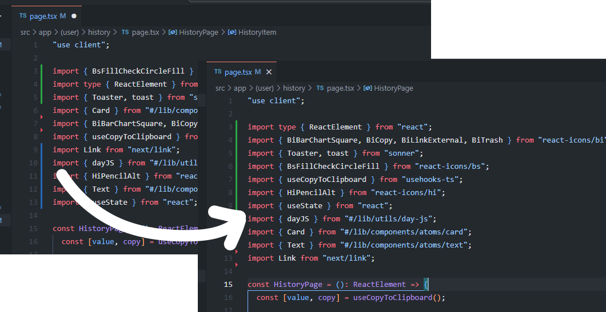

# Sort Imports

Sort your imports on save.

Work with the following languages:
- JavaScript
- TypeScript
- Python
- Java
- C#
- C++
- Ruby
- PHP
- Swift
- Go
- Kotlin
- Rust
- Scala
- Groovy
- Perl
- Lua
- R
- Matlab
- Haskell
- Shell

## Features

Save your file and it will sort your imports.

